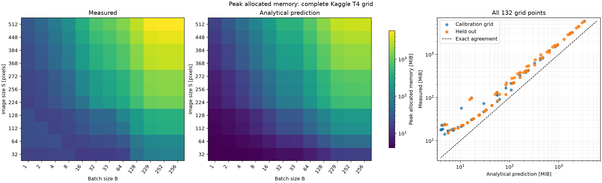
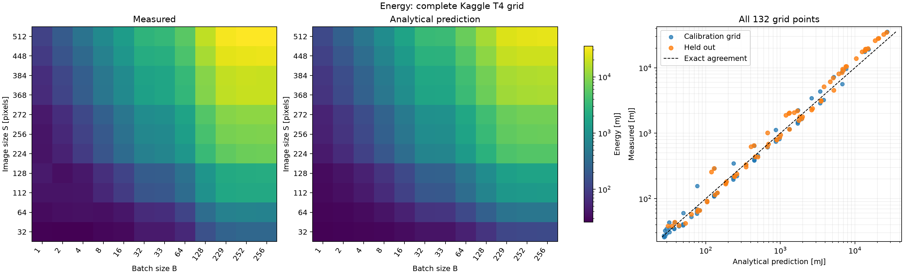
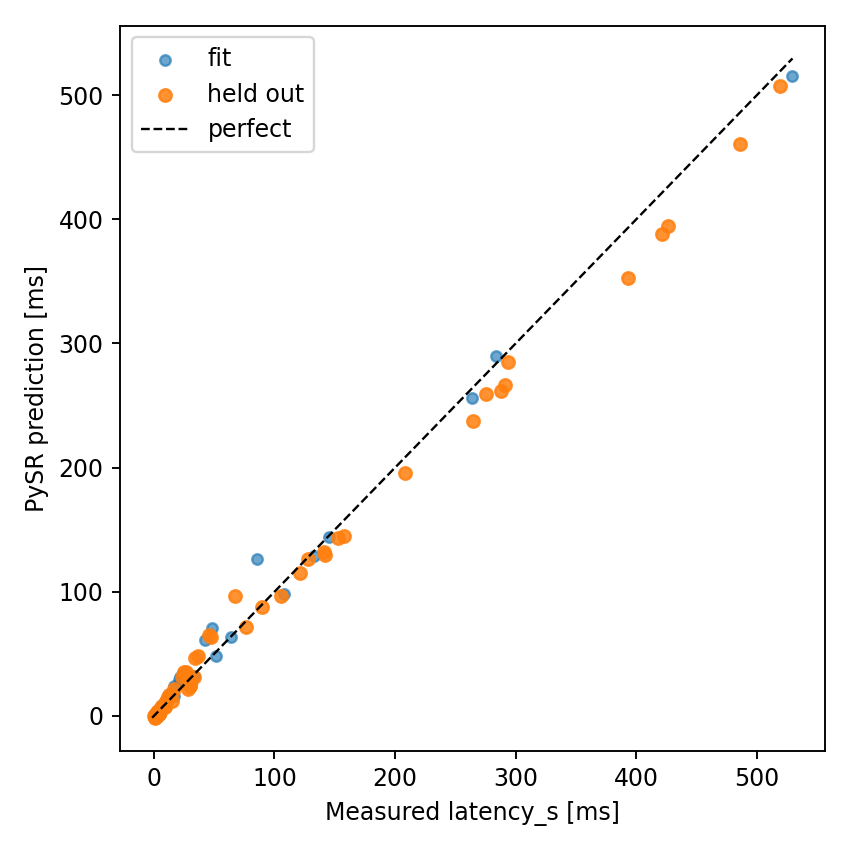
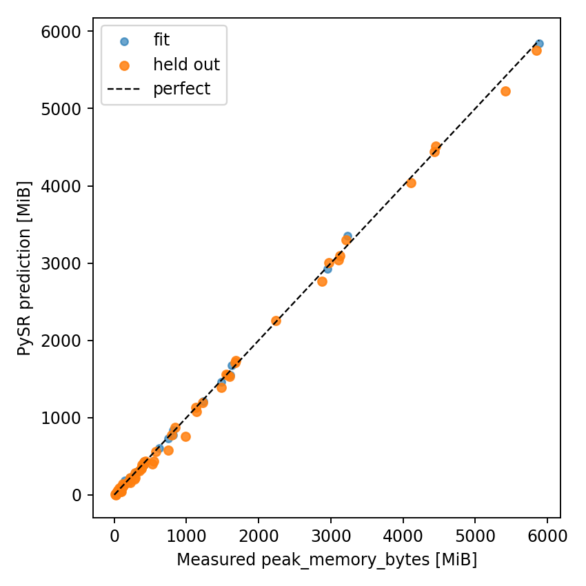
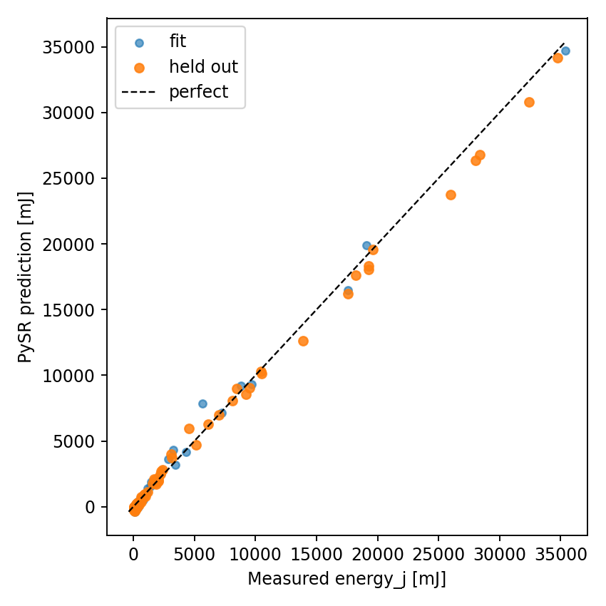

# Homework 1 — analytical performance model of a small CNN

This folder contains the network, four vectorized analytical functions, the T4 measurements, calibration code, held-out checks, plots, kernel traces, and the [scanned handwritten derivations](hw1_handwritten.pdf). The GPU experiment ran on a Kaggle Tesla T4 and can be reproduced with [kaggle_measure.py](kaggle_measure.py).

## Network and measurement protocol

The sequential network in [models.py](models.py) has six bias-free convolutions with an in-place ReLU after each, one MaxPool, global average pooling, and two biased linear layers. There is no BatchNorm layer in the assignment's actual layer table, so none was added. The input is random FP32 `B × 3 × S × S`, output is `B × 100`, and the model is in `eval()` plus `torch.inference_mode()`.

The run used one **Tesla T4**, Python 3.12.13, PyTorch 2.10.0+cu128, CUDA 12.8, cuDNN 9.10.2 and NVIDIA driver 580.159.04. `cudnn.benchmark`, `cudnn.allow_tf32` and `cuda.matmul.allow_tf32` were all `False`. The fixed seed was 2026; additional sizes were **112, 272, 368, 448** and additional batches **33, 229, 252**. The 63 base-grid points calibrated parameters; the other 69 points were held out, split into 36 new-size only, 21 new-batch only, and 12 with both new.

For each of the 132 configurations, the notebook performed three independent trials. Each trial warmed up for at least 20 forwards and 0.5 s, then measured a separate forward's PyTorch peak allocation. Latency was the median of at least 20 synchronized forward timings over at least 0.5 s, with no NVML polling thread. Whole-GPU energy came from the NVML energy counter over a separate burst of at least 3 s, divided by its forward count; **idle energy was not subtracted**. GPU temperatures, clocks, power readings, both energy estimators and timing dispersion are in [measurements.csv](results/measurements.csv) and [trials.csv](results/trials.csv). The randomized grid order and all run settings are recorded in [metadata.json](results/metadata.json).

All **132/132** configurations succeeded; no OOM occurred. There are **396/396** raw trials and a CUDA kernel profile for every point. [Diagnostics](results/diagnostics.json) report zero short warmups, short timing windows, unstable trials, changing memory peaks or disagreeing energy estimators. The largest measured peak was **5,883 MiB** at `S=512, B=256`, so this run cannot empirically test the OOM boundary. The layerwise names and launches are in [kernels.csv](results/kernels.csv).

## Four equations

Let `W=1,040,324` be the parameter count. Count one MAC as two FLOPs, ignore comparison operations in ReLU/MaxPool, and count the additions and final division of GlobalAvgPool. `D` is a nominal read/write proxy: one read and write per layer output, separate in-place ReLU traffic, and one weight read. It omits cache behavior and cuDNN temporary buffers. The layer-by-layer derivation is in [hw1_handwritten.pdf](hw1_handwritten.pdf).

$$
\begin{aligned}
F(S,B) &= B(17{,}714S^2+313{,}344) &&\text{FLOPs},\\
M_{\rm ideal}(S,B) &= 4W+52BS^2 &&\text{bytes},\\
D_{\rm nominal}(S,B) &= 4[W+B(91S^2+2{,}148)] &&\text{bytes},\\
T(S,B;\theta) &= t_0+\max\left(\frac{F(S,B)}{P},\frac{D_{\rm nominal}(S,B)}{Q}\right) &&\text{seconds},\\
E(S,B;\theta_E) &= P_{\rm GPU}\,T(S,B;\theta) &&\text{joules}.
\end{aligned}
$$

`M_ideal` is the exact peak of the **logical live-tensor model** with the caller's input retained, and is only a **lower bound** for the requested `torch.cuda.max_memory_allocated()` metric: PyTorch also counts implementation-specific cuDNN workspace. It has no fitted coefficient. In [equations.py](equations.py), `flops`, `memory`, `latency` and `energy` accept scalars or broadcasting NumPy arrays; `bytes_moved` supplies the latency/energy proxy.

Only the 63 base-grid points were used to calibrate `θ`. [calibrate.py](calibrate.py) minimizes squared logarithmic latency residuals, then fits the effective whole-GPU power to predicted latency on the same points. The values in [theta.json](results/theta.json) are:

| Parameter | Calibrated value | Interpretation |
|---|---:|---|
| `t₀` | 0.347573 ms | fixed Python/launch/synchronization overhead |
| `P` | 2.94823 TFLOP/s | effective arithmetic throughput |
| `Q` | 0.0743870 TB/s | effective nominal-byte throughput; weakly identified |
| `P_GPU` | 67.0047 W | effective whole-GPU power, including idle component |

These are fit parameters, not independent measurements of T4 hardware limits.

## Results on unseen points

Errors below use **only the 69 held-out configurations**. MdAPE is the median of `|prediction − measurement| / measurement`. The memory equation is purposefully a no-workspace bound, so its large error is an important result rather than a fitted-memory claim.

| Metric | Measured range on all 132 points | Held-out MdAPE | Held-out MAE |
|---|---:|---:|---:|
| Latency | 0.452–529.563 ms | 17.56% | 20.93 ms |
| Peak allocated memory | 14.16–5,883.26 MiB | 46.41% | 435.10 MiB |
| Energy per forward | 0.0259–35.3931 J | 16.61% | 1.374 J |

For unseen **sizes only**, latency/energy MdAPE are 15.20%/14.86%; for unseen **batches only**, 23.53%/23.57%; when both are unseen, 27.90%/28.28%. The full metrics, including the 95th percentile error, are in [analysis_summary.json](results/analysis_summary.json), and every prediction is in [predictions.csv](results/predictions.csv).

Each figure shows all measured grid values, the corresponding analytical prediction, and a measured-versus-predicted panel with units:






## Where the equations break

At `S=32, B=1`, measured latency is **0.487 ms** versus **0.409 ms** predicted; fixed host/launch overhead dominates. The calibrated roofline labels 17 points launch-bound and 115 compute-bound. For some small points nominal bytes take longer than nominal FLOPs, but the fixed term still dominates. Therefore these data **do not isolate a verified memory-bound regime**; claiming a measured launch → memory → compute transition would go beyond the evidence. The byte-throughput parameter is weakly identified.

At `S=224, B=16`, measured latency is **4.850 ms** versus **5.173 ms** predicted. At the held-out `S=272, B=229`, it is **142.045 ms** versus **102.168 ms**. At `S=512, B=256`, it is **529.563 ms** versus **403.589 ms**. The profiler records **23**, **388**, and **1,225** CUDA kernels for these three configurations, respectively; the first convolution alone contributes **364** and **1,201** kernels in the latter two. cuDNN switched to FFT-style convolution work, so a fixed launch term and one throughput cannot capture these shape-dependent algorithm changes.

Measured peak allocation exceeds the live-tensor bound by **1.38–5.84×** (median **1.93×**). For example, at `S=512, B=256` the bound is **3,332 MiB** while PyTorch reports **5,883 MiB**. Temporary cuDNN workspaces and transformed buffers are plausible contributors, but the run did not isolate each allocation. The layer table alone cannot give their exact size. Thus the bound is useful for reasoning about tensor storage but cannot safely predict OOM.

Energy roughly tracks duration because the NVML counter measures the whole GPU and includes idle power. At the largest point, measured energy is **35.393 J** versus **27.042 J** predicted; the latency miss carries through to energy. This model also assumes a constant effective power even though temperature, clocks and workload mix can change it.

## Exploratory PySR comparison

The Kaggle notebook also fit symbolic regressions on the same 63 calibration points. In the formulas below `S=image_size`, `B=batch_size`; the original CSV columns remain `S,B` because `S` is reserved by SymPy. These are **empirical alternatives**, not the required derivations. Exact PySR outputs and their parity plots are in [results/pysr](results/pysr) and [results/figures](results/figures).

$$
\begin{aligned}
T_{\rm SR}(S,B) &= \frac{S^2(B-1)}{359.71133\cdot359.26807}-\frac{S}{359.26807} &&\text{ms},\\
M_{\rm SR}(S,B) &= 0.0028312632\,S\bigl(B+0.028787112\,BS\bigr) &&\text{MiB},\\
E_{\rm SR}(S,B) &= 0.00048781637\,BS(0.15323526B+S)-S &&\text{mJ}.
\end{aligned}
$$

| PySR target | Calibration MdAPE | Held-out MdAPE | Non-positive predictions |
|---|---:|---:|---:|
| Latency | 42.92% | 19.43% | 22/132 |
| Peak memory | 15.22% | 8.15% | 0/132 |
| Energy | 83.77% | 13.20% | 42/132 |

The latency and energy expressions become non-physical at small batches. That makes their attractive held-out summaries misleading; the analytical latency and energy equations remain positive by construction. The PySR parity plots are included for direct inspection:







## Reproduction and files

On a Kaggle T4 with Internet enabled, upload [kaggle_measure.py](kaggle_measure.py) and execute it. Its `--fit-only` option reuses existing measurements after a failed PySR stage. [measure.py](measure.py) is a thin command-line entry point when the whole `hw1` folder is available.

To reproduce calibration and plots from the committed CSVs on a local computer:

```bash
python -m pip install -r hw1/requirements-analysis.txt
python hw1/calibrate.py
```

The scanned [hw1_handwritten.pdf](hw1_handwritten.pdf) is included with the source code, measurements, kernel names, calibrated parameters, and figures.
